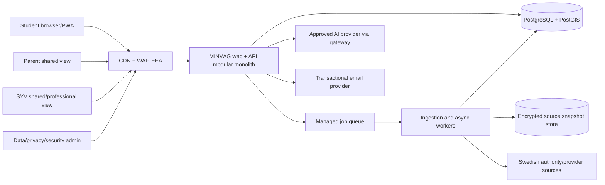
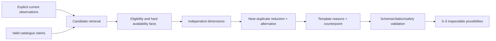

# 09 — Technical architecture

<!-- markdownlint-disable MD013 -->

> **Status:** Proposed review architecture, not implemented
> **Style:** EEA-hosted modular monolith + isolated workers
> **Primary quality:** trustworthy degradation—rules and saved work do not depend on AI

## 1. Architectural drivers

1. Users are minors and grade/profile/path data is sensitive in context.
2. Education facts and rules change and must be reproducible as-of a date.
3. Missing/conflicting source data is normal and must remain visible.
4. Eligibility is deterministic; language generation is optional.
5. Mobile devices/networks and cognitive load require small payloads and simple screens.
6. A small team should operate the MVP; microservices would add risk without evidence.
7. School procurement may introduce organisations/roles, but students require strong personal control.
8. Sweden-only logic must not become hard-coded throughout the UI/domain.

## 2. Context diagram



All selected vendors and subprocessors require DPIA/vendor/transfer review. “Hosted in EU” alone is not sufficient if third-country remote access exists. [L05](SOURCES.md#privacy-safety-ai-and-accessibility-sources)

## 3. Deployment units

| Unit | Responsibility | Scaling/failure boundary |
| --- | --- | --- |
| Web/API | Server-rendered mobile web, REST BFF, domain use cases | Horizontally replicated; stateless except encrypted session cookies. |
| Worker | Source fetch/parse/validate, report processing, exports/deletions, async AI where needed | Separate network identity and queues; source failure cannot exhaust interactive API. |
| PostgreSQL/PostGIS | Transactional truth, knowledge graph tables, bitemporal claims, coarse spatial queries | Multi-AZ managed database in one EEA region; point-in-time recovery and encrypted backups. |
| Object storage | Licence-permitted immutable raw source snapshots and generated exports | Separate bucket/key policies; retention classes; no public access. |
| Managed queue | Idempotent jobs with retry/dead-letter | No sensitive payload where an internal ID can be used. |
| AI gateway (module) | Minimisation, prompt templates, evidence packets, output validation, kill switch | Provider outage falls back to templates; no core blocking dependency. |

No Kubernetes, event-streaming platform, graph database or distributed cache in MVP. Add only from measured need.

## 4. Application modules

```text
apps/web-api
  identity          authentication, sessions, recovery, age-appropriate notices
  profile           explicit observations and self-reported grades
  catalog           education, offering, occupation read models
  eligibility       deterministic versioned rule interpreter
  recommendation    candidate retrieval, dimensions, diversity, explanations
  pathways          knowledge-graph queries and student path snapshots
  actions           finite next-action catalogue and state machine
  sharing           parent/SYV payloads, grants, access history
  provenance        claim resolution, freshness, conflict, source sheets
  feedback          correction/safety reports and triage
  privacy           export, deletion, retention, grants/preferences
  organisations     school/SYV roles and aggregate views
  ai                 bounded generation adapter, policy and evaluation hooks
  analytics         approved first-party events only
  admin              source/rule/content review with dual control

workers
  ingest             source adapters → snapshots → staging → validation → publish
  maintenance        freshness, conflict, retention and access reviews
  async              exports, deletions, notifications, approved model jobs
```

Module boundaries are enforced in code and database access conventions, but deploy together initially. Eligibility cannot import the AI module. Recommendations consume eligibility results but cannot mutate them.

## 5. Request paths

### Programme detail

1. Browser sends `GET /v1/catalog/programmes/{id}?asOf=…`.
2. Catalogue resolves an immutable entity and current valid claims.
3. Provenance module applies field-level source precedence and flags conflicts/staleness.
4. API returns plain data plus `claim_refs`; source sheet is fetchable separately.
5. CDN may cache public data by locale/as-of/source version; no user data in cache keys/logs.

### Eligibility evaluation

1. Browser sends minimum self-reported subject outcomes plus target programme/cohort.
2. API validates codes and completeness.
3. Rule module selects exact approved rule version by country/framework/validity.
4. Interpreter produces result, missing inputs/requirements and calculation trace.
5. A template renders Swedish explanation. Optional AI simplification can never alter structured fields.
6. Evaluation stores input classification, rule/claim IDs and content hash for audit.

### Recommendation



A score may exist inside one documented dimension for retrieval efficiency, but is never exposed or combined as universal “match.” Protected attributes and sensitive proxies are excluded. Sort reason is returned.

### Source ingestion

1. Scheduled adapter downloads with conditional request/checkpoint.
2. Store licence-permitted raw bytes, request metadata and hash.
3. Parse into source-specific staging schema.
4. Validate schema, code sets, temporal rules, quality thresholds.
5. Resolve/match entities without name-only merges.
6. Create immutable claims/relationships and conflicts.
7. Human approval for rule changes and critical relation changes.
8. Atomically publish dataset version/read model; keep rollback pointer.
9. Emit source-health metrics and freshness notifications.

## 6. Trust boundaries and network design

| Boundary | Controls |
| --- | --- |
| Public internet → edge | TLS, WAF/bot/rate controls, strict host/origin, security headers, DDoS service. |
| Edge → web/API | Authenticated private origin where possible; no direct origin exposure. |
| App → database | Private network, TLS, workload identity, least-privilege roles per runtime, prepared queries. |
| Worker → external sources | Egress allowlist where practical, time/size/content-type limits, archive bomb/XML/SSRF defence. |
| App → AI | Gateway allowlist, minimal evidence packet, no arbitrary URL fetch/tools, time/token limits, structured output. |
| Admin plane | Separate route/policy, phishing-resistant MFA, managed devices/conditional access where feasible, dual control. |
| Organisation tenancy | `organisation_id` scoping, PostgreSQL RLS/verified repository policies, cross-tenant tests and audit. |

## 7. Identity and sharing

- Anonymous browser state uses short-lived, random session ID and minimal server state; no cross-site tracking.
- Account via passkey or verified magic link, with recovery codes/options designed for minors. Do not collect personnummer.
- Student and organisation identities remain separate; linking requires transparent invitation.
- Parent/SYV grant contains subject, recipient, scope, payload snapshot, purpose, expiry, revocation and access log.
- Public tokens store a server-side hash, are high entropy, single-purpose and never enter analytics/referrer logs.
- Organisation roles: `syv`, `data_steward`, `support`, `privacy_admin`, `security_admin`; no generic super-admin for routine work.
- Break-glass access is exceptional, time-limited, reasoned, alerted and reviewed.

## 8. Data classification

| Class | Examples | Treatment |
| --- | --- | --- |
| Public authority data | Programme names, national rules | Public cache permitted subject to source terms; provenance retained. |
| Internal operational | Source health, non-personal reports | Authenticated; retention by operational need. |
| Personal | Account email, saved path, comments | Encrypted, access-controlled, purpose/retention limited. |
| Contextually sensitive minor data | Self-reported grades, preferences, parent/SYV shares | Separate tables/scopes, never in logs/analytics/AI unless strictly necessary and approved. |
| Highly restricted | Auth secrets, recovery tokens, security events | Dedicated secrets/token hashing, very limited roles. |

No diagnoses, exact home address, personnummer, raw school record, contact list or inferred personality.

## 9. AI independence and safety

- Eligibility and admission-context comparisons are code/templates.
- AI accepts a closed evidence packet of approved claim text and explicit observations; no database/network tools.
- Every response validates against a schema and allowed claim IDs.
- Prompt-injected source text is untrusted data, delimited and stripped of executable instructions.
- Provider receives pseudonymous task ID, not account/email/organisation.
- Inputs/outputs for critical evaluation are retained only under a DPIA-approved, short schedule; analytics never receives raw text.
- Kill switch per use case/model; template fallback; provider circuit breaker and spend cap.

## 10. Reliability and degradation

| Failure | User behaviour |
| --- | --- |
| AI unavailable/invalid | Use reviewed template; no loss of eligibility/path/catalogue. |
| One authority source down | Serve last verified claim with stale banner if safe; do not invent refresh. |
| Rule conflict/change under review | Stop affected evaluation and offer official/SYV verification. |
| Admission feed unavailable | Show eligibility and “historical uppgift saknas”; no forecast. |
| Transit unavailable | Show location text and manual journey-check action. |
| Database failover | Read-only maintenance message; no writes claimed successful until durable. |
| Email unavailable | Existing session continues; queue notification; do not expose token. |
| Partial deployment | Backward-compatible API/schema migration and feature flag rollback. |

Targets for review: 99.9% monthly interactive availability, RPO ≤15 minutes, RTO ≤4 hours. These are hypotheses to test against budget and school needs, not current commitments.

## 11. Observability

- Structured logs with request/job/source IDs; automated redaction and no grade/profile text.
- Metrics: latency/errors, queue depth, source freshness/conflicts, rule version use, AI validation/fallback, share abuse and access anomalies.
- Traces sample technical spans only; attributes use entity IDs, never account email/free text.
- Security logs are tamper-evident, separately retained and access-restricted.
- Alerts have owner, severity, runbook and test cadence.

## 12. Secure delivery

- Pinned dependencies/lockfile, SBOM, secret/dependency/SAST scans, signed build provenance.
- Protected branch and two-person review for rules, access, deletion and AI policy.
- Infrastructure as code and no console-only production changes.
- Separate dev/test/stage/prod accounts and keys; only synthetic data outside production.
- Migrations are forward/backward compatible with tested restore/rollback.
- Feature flags cannot bypass authorisation or privacy controls.

## 13. Country abstraction

Country is an explicit domain package, not a premature plugin platform:

```text
CountryPolicy {
  countryCode: "SE"
  educationFrameworkVersions: ["GY11", "GY25"]
  locale: "sv-SE"
  ruleSetIds: [...]
  sourcePrecedencePolicyId: ...
  terminologyPackId: ...
}
```

Only `SE` exists in MVP. No generic lowest-common-denominator education model.

## 14. Architecture decisions to validate

- Hosting/vendor selection after public-sector procurement, subprocessor and transfer review.
- Whether passkeys have adequate device/recovery usability for target students.
- Whether PostgreSQL RLS plus service-layer checks is preferable to separate school schemas.
- Snapshot retention permitted by each source licence.
- Exact anonymous-session retention and device-shared privacy behaviour.
- AI use may be removed entirely if templates outperform it.
