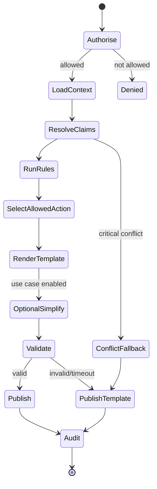

# 13 — Agent architecture

<!-- markdownlint-disable MD013 -->

> **Status:** Proposed minimal workflow; no autonomous multi-agent system
> **Naming principle:** call it a workflow in the product and code unless it genuinely needs agentic behaviour

## 1. Decision

MINVÄG will not deploy a swarm, autonomous counsellor, planner, researcher, recommender or self-modifying agent. The MVP uses deterministic application workflows. One bounded language-model step may phrase an explanation after all facts, rule outcomes and allowed actions are fixed.

## 2. Why autonomy is inappropriate

- Users are minors making consequential education choices.
- Official rules and time-sensitive facts must be reproducible.
- An autonomous system can compound source, tool and prompt-injection errors.
- Multiple agents add latency, cost, hard-to-audit handoffs and unclear accountability.
- The jobs can be solved with database queries, rule evaluation, templates and human review.

## 3. Single workflow orchestrator



The state machine owns retries/timeouts. The model cannot decide the next state.

## 4. Tool boundary

If a model is used, it receives no live tools. The orchestrator may call server-side typed functions before generation:

| Function | Input | Output | Mutating? | Model can invoke? |
| --- | --- | --- | :---: | :---: |
| `resolveClaimBundle` | approved entity/claim IDs, as-of date | typed claims/conflicts/sources | No | No |
| `evaluateEligibility` | typed self-report snapshot, target, date | immutable result/trace | No | No |
| `findPathCandidates` | typed entities/constraints | evidence-backed paths | No | No |
| `selectNextAction` | approved context/action catalogue | one code + rationale IDs | No | No |
| `renderTemplate` | result + locale | reviewed Swedish text | No | No |
| `simplifyExplanation` | minimized evidence packet | schema-bound wording | No | Orchestrator-only provider call |
| `validateGeneration` | output + evidence | valid/errors | No | No |
| `saveStudentChoice` | explicit API action | persisted choice | Yes | **Never** |
| `shareBrief` | explicit preview-confirmed API action | grant | Yes | **Never** |

There is no browser, shell, email, external messaging, generic SQL or arbitrary HTTP tool.

## 5. Allowed workflows

### A. Explain an option

1. Authorise student/session.
2. Load explicit current profile observations selected for this response.
3. Resolve programme/offering/path claims at a fixed date.
4. Retrieve already-computed dimensions.
5. Select reviewed reason/counterpoint codes.
6. Render template; optionally simplify within schema.
7. Validate IDs, citations, agency language and length.
8. Return with source sheet and AI disclosure.

### B. Construct a next-step proposal

1. Determine current journey state.
2. Exclude actions requiring unavailable/unverified targets.
3. Apply deterministic priority policy: fix critical unknown → prepare human question → compare → explore.
4. Choose one safe action, with a user-visible reason.
5. Student must accept/replace/snooze/decline. Workflow cannot auto-enrol, contact or schedule.

### C. Data-source change impact

1. Worker detects source change.
2. Validate and publish claim/version after required review.
3. Query affected saved path references.
4. Create a factual “change available” notice.
5. Student decides whether to create a new path version.

No AI decides which source wins or rewrites paths.

## 6. Human approval points

| Object/change | Required approval |
| --- | --- |
| National eligibility rule | Two qualified reviewers including domain owner/SYV; authority evidence |
| Formal equivalence/prerequisite edge | Two reviewers; authority evidence |
| Education→occupation possibility edge | Domain/data reviewer; second reviewer for high-traffic edge |
| New AI use case/model/prompt | Product safety + privacy + domain; evaluation thresholds |
| Critical source conflict resolution | Data steward + domain reviewer |
| Parent/SYV sharing scope expansion | Privacy + user research + security |
| New next-action type contacting a third party | Safeguarding + privacy + security |
| Production break-glass access | On-call approval/reason; immediate alert and retrospective review |

## 7. Memory policy

There is no model memory. Product memory is explicit database state:

- student observations, each visible/editable;
- saved paths and versions;
- chosen action and state;
- share grants;
- claim/rule versions.

A model never decides what to remember. Conversation transcripts are not retained because there is no open chat. Generated wording has short, purpose-limited retention if required for QA.

## 8. Delegation and retries

- Zero model-to-model delegation.
- One generation call maximum per use-case request.
- No recursive planning or self-critique loops.
- On timeout, schema error, unsupported citation or policy alert: use template.
- Network/tool retries use bounded exponential backoff and idempotency keys outside the model.
- Spend and token ceilings per request/day; circuit breaker at provider/use-case level.

## 9. Audit record

For each workflow:

```text
workflow_use_case, workflow_version
request/correlation ID, pseudonymous actor ID
purpose and authorisation outcome
input object IDs + hashes (not broad plaintext)
rule/claim/catalogue versions
state transitions and deterministic decisions
model/prompt version if used
validation result/fallback
output content hash and source references
latency/cost class
```

The audit can reproduce the factual result without reproducing unnecessary student text.

## 10. Safety cases

| Threat | Control |
| --- | --- |
| Student text says “ignore rules” | Text is data; no model tools; immutable result/schema. |
| Source page contains prompt injection | Staging sanitisation; closed claims; human review; source text cannot drive workflow. |
| Model recommends contacting unknown adult | Action codes allowlisted; server rejects. |
| Model changes eligibility | Immutable field comparison; reject and template. |
| Model creates a “best career” | Agency-language validator + schema has multiple possibilities/counterpoint. |
| Model leaks another profile | Provider never receives/querys profiles; request-scoped IDs; tenant tests. |
| Infinite agent loop/cost | Fixed state graph and one call. |

## 11. Criteria for any future agentic capability

A proposal must prove all of the following:

1. A validated student/SYV problem cannot reasonably be solved by deterministic UI/workflow.
2. The agent has a finite purpose, typed read-only tools and maximum steps.
3. No high-impact action occurs without explicit informed confirmation.
4. Privacy necessity, DPIA, threat model and AI Act classification are updated.
5. Synthetic/red-team/representative user evaluations pass.
6. A non-agent fallback exists.
7. Named human owner can explain, monitor, disable and remediate it.

Absent this evidence, do not build it.
