# 16 — Data provenance architecture

<!-- markdownlint-disable MD013 -->

> **Status:** Proposed trust architecture
> **Goal:** Every important claim can answer **who says this, what exactly applies, when it was true/checked, how it changed, and how certain MINVÄG is about coverage/inference**

## 1. Provenance is user-facing

Provenance is not a footer or data-team-only lineage graph. It is part of recommendation quality. Students must be able to distinguish:

- an official eligibility rule;
- a provider statement about its own offering;
- a past admission observation;
- an official labour forecast;
- a MINVÄG scenario/inference; and
- an unknown or conflict.

## 2. Pipeline layers

```mermaid
flowchart LR
  Registry[Source registry + terms]
  Raw[Immutable permitted snapshot]
  Stage[Source-specific staging]
  Validate[Schema/quality/identity validation]
  Claims[Immutable temporal claims]
  Resolve[Field-level precedence + conflict]
  Read[Versioned read model]
  Product[Card/path/rule/recommendation]
  Sheet[Source sheet + correction]

  Registry --> Raw --> Stage --> Validate --> Claims --> Resolve --> Read --> Product --> Sheet
```



No product screen reads directly from a scraper/API response. No AI-written paragraph becomes a source claim.

## 3. Source registry

For each source/endpoint:

- owner/legal entity and authority role;
- source class and field-specific precedence;
- URL/API request template and authentication;
- schema/dataset/version;
- expected update cadence and publication lag;
- licence, attribution, retention and redistribution terms;
- geographic/population/temporal coverage;
- contact/correction channel;
- parser/transform owner;
- last successful fetch/validation/publish;
- known limitations and fallback;
- security sensitivity and allowlist status.

Human reviewers approve a source for each use. Being official does not mean every field is complete or current.

## 4. Claim model

A claim is atomic enough to conflict independently:

```json
{
  "claim_id": "uuid",
  "subject": {"entity_id": "uuid", "type": "education_offering"},
  "predicate": "offering_status",
  "value": {"code": "planned"},
  "source": {
    "source_id": "skolverket_planned_education",
    "snapshot_id": "uuid",
    "record_pointer": "/results/117/status",
    "content_hash": "sha256:…"
  },
  "valid_time": {"from": "2026-08-01", "to": null},
  "system_time": {"observed": "2026-08-26T03:00:00Z", "recorded": "…"},
  "transformation": {"id": "uuid", "version": "git:…"},
  "quality": {
    "authority": "high",
    "coverage": "partial",
    "freshness": "within_sla",
    "conflict": "none"
  },
  "status": "active"
}
```

A programme description, offering status, address, open-house date and historical cut-off are separate claims even if one source record contains them.

## 5. Temporal model

Use bitemporal concepts:

- **Valid/applicability time:** when the source says the fact/rule applies in the world.
- **System/knowledge time:** when MINVÄG observed and recorded it.

Questions this enables:

- “What did the product show on 12 January?”
- “Which Gy25 rule applied to an education starting August 2026?”
- “Was this open house already expired?”
- “Did a recommendation use a claim before a correction?”

Corrections supersede; history is not overwritten. Student saved paths pin graph/read-model versions.

## 6. Source precedence

Precedence is field-specific, not one global source ranking.

| Field | Preferred | Secondary/context | Conflict behaviour |
| --- | --- | --- | --- |
| National eligibility rule | law/current Skolverket rule owner | official explanatory guide | Block calculation if authoritative interpretation conflicts. |
| School-unit identity/status | Skolenhetsregistret | provider page | Preserve both; authority ID/status wins within scope. |
| Local offering status | current authority/planned-offering feed | provider page/region | Show conflict if dates/status differ; propose verification action. |
| Open-house event | provider’s current official page | regional listing | Newer direct provider claim may win; event auto-expires. |
| Historical admission value | responsible regional admission office/official dataset | licensed aggregator | Do not display if round/group/value semantics are ambiguous. |
| Occupation taxonomy | Arbetsförmedlingen/SCB code systems | editorial aliases | Official concept; aliases aid search only. |
| Salary statistic | SCB | none for canonical statistic | Retain measure/population/year; no scraped salary. |
| Possible career route | formal authority requirement where one exists; otherwise reviewed mapping evidence | editorial/JobEd similarity | Label possible/common/directness; never upgrade similarity to requirement. |

Provider authority is local to provider-authored details; it cannot override national rules or regional official admissions.

## 7. Transformations

Every transformation declares:

- source snapshot IDs and field mappings;
- code/configuration version and environment;
- deterministic/non-deterministic status;
- output claims/counts/rejections;
- assumptions, units, timezone/locale and rounding;
- reviewer/test suite;
- rollback dataset version.

For PDFs/manual extraction, retain document URL/hash, page/table/cell reference, extractor method and double-review where values affect admission context. Do not present OCR-only critical values without verification.

## 8. Confidence without false precision

Never output “87% confidence” unless it is a genuinely calibrated probability for a well-defined event—which is not planned here. Show dimensions:

| Dimension | Values | Meaning |
| --- | --- | --- |
| Authority | high / medium / low | How authoritative is the claimant for this predicate? |
| Coverage | complete / partial / unknown | Does the source cover the relevant region/population/field? |
| Freshness | current / stale / expired / unknown | Relative to claim-specific SLA and validity. |
| Agreement | no conflict / conflict / resolved | Other active claims. |
| Relationship strength | required / common / possible / related | Semantics of graph edge. |
| Inference | none / low / medium / high | Product inference strength from explicit evidence; independent of factual authority. |

UI translates these into plain Swedish and progressive disclosure.

## 9. Source sheet contract

Example:

```text
Varifrån kommer uppgiften?

Behörighetskrav
Källa: Skolverket · Nationell regel
Gäller: [programtyp], utbildning med start [period]
Senast hämtad: 1 september 2026
MINVÄG kontrollerade: 2 september 2026
Tillförlitlighet: hög för regeln

Vad MINVÄG gjorde
Vi jämförde regeln med ämnen du själv fyllt i.
Regelversion: SE-GYM-ELIG 2026.2

Osäkerhet
Dina betyg är inte verifierade av skolan.

[Öppna originalkällan] [Visa beräkningen] [Rapportera fel]
```

A key source sheet is reachable in one interaction from the fact. Accessibility names include what will open.

## 10. Fact-kind labels

| Kind | Swedish label | UI treatment |
| --- | --- | --- |
| Authority fact/rule | **Fakta / Regel** | Owner and valid period prominent. |
| Historical statistic | **Historik / Statistik** | Year, measure and population. |
| Current observation | **Aktuell signal** | Observation window and coverage caveat. |
| Forecast | **Prognos** | Issuer, horizon, region, method/uncertainty. |
| Product inference | **Förslag utifrån det du har sagt** | Evidence and reset/different-option control. |
| Scenario | **Exempel – inte en prognos** | Changed assumptions visibly listed. |
| Unknown | **Uppgift saknas** | Verification action. |
| Conflict | **Olika uppgifter** | Both sources/dates and safe next action. |
| AI wording | **Formulerat med AI** | Underlying claims remain accessible. |

## 11. Freshness and service levels

Each predicate defines expected cadence, warning threshold, hard expiry, owner and degraded behaviour. See [data map](05-swedish-education-data-map.md#8-refresh-and-stale-policy-proposed-validate-with-sources).

The source-health dashboard tracks:

- last attempted/successful fetch and publication;
- HTTP/schema/parser errors;
- record/null/duplicate/change volumes;
- unmatched entity rate;
- quarantined claims and open conflicts;
- SLA/freshness breaches;
- downstream cards/paths/evaluations affected.

Public coverage page shows region/field status without internal security detail.

## 12. Conflict/correction workflow

1. Detect automatically or receive structured report.
2. Link report to claim/entity/relationship and preserve reporter evidence safely.
3. Assess severity:
   - critical: national rule/safety;
   - high: offering/admission/pathway likely to change action;
   - normal: label/editorial issue.
4. Suppress critical claim/evaluation if needed.
5. Compare source authority, scope, valid date and semantics—not only recency.
6. Resolve with rationale and named reviewer; create replacement claim.
7. Notify affected students in plain language if a saved decision artifact used it.
8. Post incident/change summary and preventive test for systemic error.

AI never resolves conflicts.

## 13. Recommendation lineage

A recommendation run records:

```text
profile observation IDs and snapshot hash
catalogue/graph/read-model versions and as-of date
candidate retrieval/algorithm version
eligibility evaluation + rule version
claim IDs per admission/feasibility/path dimension
sort/diversity reason and explicit exclusions
explanation template/model/prompt version
output validation/fallback
```

Deleting personal data removes/rekeys personal linkage under the retention policy; aggregate model-quality evidence must not re-identify the student.

## 14. Source change and student path

When a used claim changes:

- determine whether it affects wording only, a dimension, eligibility, or path edge;
- never mutate old saved path version;
- show old/new claim and dates;
- offer “granska och skapa ny version”; and
- for critical invalid claims, suppress unsafe forward use while retaining an audit explanation.

## 15. Operational ownership

- **Source owner:** relationship/terms/cadence.
- **Adapter owner:** fetch/parser/schema tests.
- **Domain reviewer:** semantics/rules/path mappings.
- **Data steward:** identity matches/conflicts/corrections.
- **Product content owner:** child-readable presentation.
- **Privacy/security:** retention, access, incident implications.

No single person can publish an unreviewed critical eligibility rule.
